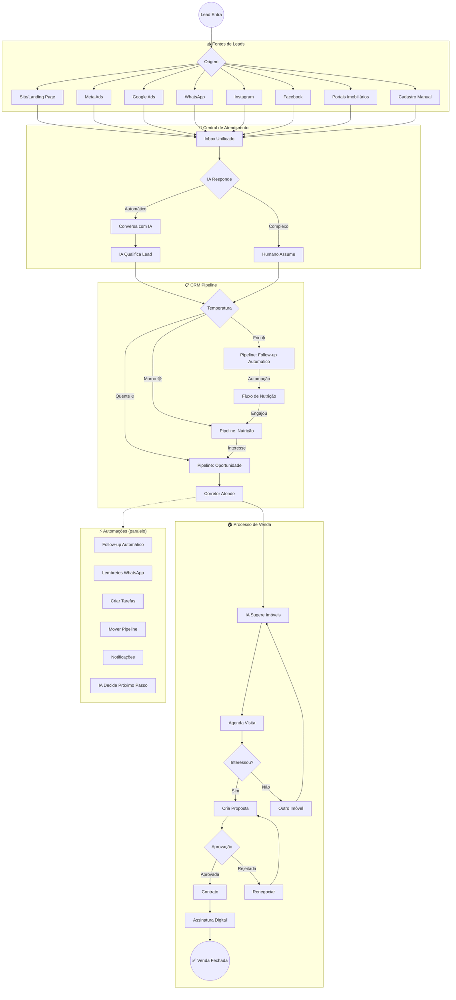
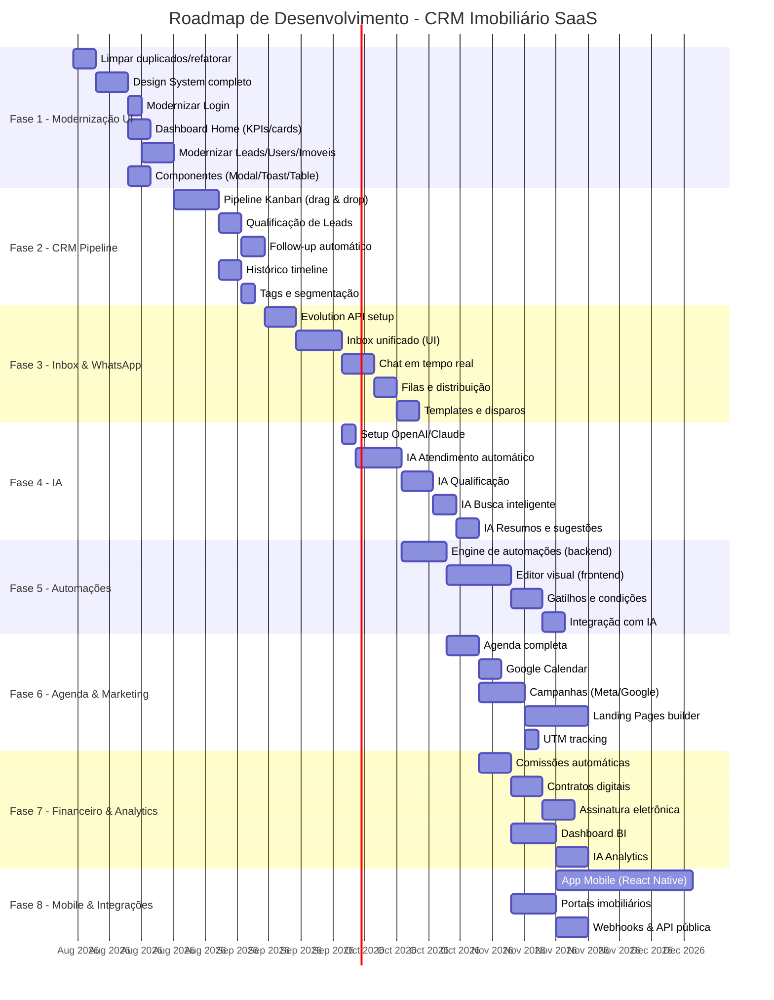
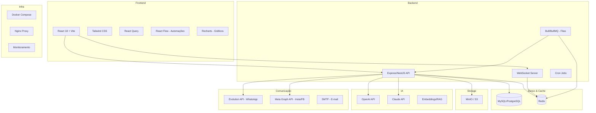

# 🗺️ Roadmap & Fluxograma Completo - CRM Imobiliário SaaS

## Visão Geral da Evolução

```
PROJETO ATUAL (v1)              →    PROJETO FUTURO (v2 - Lead2Sales-like)
─────────────────────                ────────────────────────────────────
✅ Empreendimentos               →    ✅ Empreendimentos + Imóveis avulsos
✅ Unidades + Propostas          →    ✅ Pipeline Kanban completo
✅ Visitas básicas               →    📅 Agenda completa (Google/Outlook)
✅ Leads CRUD simples            →    🤖 Leads com IA + Qualificação auto
✅ Marketing (materiais)         →    📢 Campanhas (Meta/Google/Landing)
❌ Sem comunicação               →    💬 Inbox unificado (WhatsApp/Insta/FB)
❌ Sem automações                →    ⚡ Automações visuais (n8n-like)
❌ Sem IA                        →    🧠 IA em tudo (atendimento, busca, resumos)
❌ Dashboard básico              →    📊 Analytics + BI com IA
```

---

## 🏗️ Arquitetura de Módulos

```mermaid
graph TB
    subgraph "🔐 CORE"
        AUTH[Autenticação/JWT]
        MULTI[Multi-Tenant]
        PERM[Permissões]
        USERS[Usuários/Hierarquia]
        CONFIG[Configurações]
        AUDIT[Auditoria/Logs]
    end

    subgraph "📋 CRM"
        LEADS[Leads]
        CLIENTS[Clientes]
        PIPELINE[Pipeline Kanban]
        HISTORY[Histórico]
        FOLLOWUP[Follow-up]
        TAGS[Tags/Segmentação]
        QUALIFY[Qualificação]
    end

    subgraph "🏘️ IMÓVEIS"
        EMPRE[Empreendimentos]
        UNITS[Unidades]
        PROPS[Propostas]
        IMOV[Imóveis Avulsos]
        OWNERS[Proprietários]
        PORTALS[Integração Portais]
        PHOTOS[Fotos/Vídeos/Tour]
    end

    subgraph "💬 ATENDIMENTO"
        INBOX[Inbox Unificado]
        WHATS[WhatsApp]
        INSTA[Instagram DM]
        FACE[Facebook Messenger]
        EMAIL[E-mail]
        CHAT[Chat Site]
        VOIP[Telefonia VoIP]
        QUEUE[Filas/Distribuição]
    end

    subgraph "🧠 INTELIGÊNCIA ARTIFICIAL"
        AI_ATTEND[IA Atendimento]
        AI_QUALIFY[IA Qualificação]
        AI_SUMMARY[IA Resumos]
        AI_SEARCH[Busca Inteligente]
        AI_SUGGEST[IA Sugestões]
        AI_FOLLOWUP[IA Follow-up]
        AI_INSIGHTS[IA Insights/Analytics]
    end

    subgraph "⚡ AUTOMAÇÕES"
        FLOWS[Fluxos Visuais]
        TRIGGERS[Gatilhos]
        ACTIONS[Ações]
        WAITS[Esperas/Delays]
        CONDITIONS[Condições]
        AI_DECIDE[IA Decisão]
    end

    subgraph "📅 AGENDA"
        VISITS[Visitas]
        EVENTS[Eventos]
        TASKS[Tarefas]
        CALENDAR[Calendário]
        GOOGLE_CAL[Google Calendar]
        OUTLOOK[Outlook]
        REMINDERS[Lembretes]
    end

    subgraph "📢 MARKETING"
        CAMPAIGNS[Campanhas]
        META_ADS[Meta Ads]
        GOOGLE_ADS[Google Ads]
        LANDING[Landing Pages]
        UTM[UTM Tracking]
        MATERIALS[Materiais Físicos]
    end

    subgraph "💰 FINANCEIRO"
        COMISSIONS[Comissões]
        CONTRACTS[Contratos]
        SIGNATURES[Assinatura Digital]
        BILLING[Cobranças]
    end

    subgraph "📊 DASHBOARD/ANALYTICS"
        KPIS[KPIs]
        CONVERSION[Conversão]
        RANKING[Ranking Corretores]
        AI_ANALYTICS[IA Analytics]
        REPORTS[Relatórios]
        FORECAST[Previsões]
    end

    subgraph "🔌 INTEGRAÇÕES"
        EVOLUTION[Evolution API - WhatsApp]
        OPENAI[OpenAI/Claude/Gemini]
        GOOGLE_API[Google APIs]
        META_API[Meta APIs]
        PORTALS_API[Portais Imobiliários]
        WEBHOOKS[Webhooks]
    end

    %% Conexões principais
    AUTH --> MULTI
    MULTI --> PERM
    LEADS --> PIPELINE
    PIPELINE --> QUALIFY
    INBOX --> AI_ATTEND
    AI_ATTEND --> QUALIFY
    QUALIFY --> PIPELINE
    PIPELINE --> FOLLOWUP
    FLOWS --> TRIGGERS
    TRIGGERS --> CONDITIONS
    CONDITIONS --> ACTIONS
    WHATS --> EVOLUTION
    AI_ATTEND --> OPENAI
    CAMPAIGNS --> META_API
```



---

## 🔄 Fluxo Principal do Sistema



---

## 📅 Fases de Desenvolvimento (Roadmap)



---

## 🧩 Detalhamento por Fase

### FASE 1 — Modernização do Frontend Atual
**Objetivo**: Deixar o que já existe com qualidade visual profissional.

| Tarefa | Prioridade | Estimativa |
|--------|-----------|-----------|
| Limpar arquivos duplicados (Aguardar/Aguardando, Create/Criar) | 🔴 Alta | 1 dia |
| Componentes UI: Modal, Badge, Table, Spinner, Toast, Pagination | 🔴 Alta | 5 dias |
| Refatorar Login.jsx (design moderno, dark theme) | 🔴 Alta | 2 dias |
| Dashboard Home com KPIs, gráficos, atividades recentes | 🔴 Alta | 4 dias |
| Modernizar Leads (lista + filtros + Kanban) | 🟡 Média | 3 dias |
| Modernizar Users/Equipe (organograma visual) | 🟡 Média | 3 dias |
| Modernizar Imóveis (grid com cards + fotos) | 🟡 Média | 3 dias |
| Dark/Light mode toggle | 🟢 Baixa | 1 dia |

### FASE 2 — Pipeline CRM Completo
**Objetivo**: Transformar o CRM básico em um funil de vendas real.

| Tarefa | Prioridade | Estimativa |
|--------|-----------|-----------|
| Pipeline Kanban (drag & drop entre colunas) | 🔴 Alta | 7 dias |
| Etapas configuráveis do funil | 🔴 Alta | 3 dias |
| Qualificação automática (quente/morno/frio) | 🔴 Alta | 3 dias |
| Follow-up com lembretes | 🟡 Média | 3 dias |
| Timeline de atividades por lead | 🟡 Média | 3 dias |
| Sistema de tags | 🟢 Baixa | 2 dias |
| Score de lead | 🟢 Baixa | 2 dias |

### FASE 3 — Inbox Unificado + WhatsApp
**Objetivo**: Centralizar toda comunicação em um único lugar.

| Tarefa | Prioridade | Estimativa |
|--------|-----------|-----------|
| Setup Evolution API (WhatsApp) | 🔴 Alta | 5 dias |
| Inbox UI (lista de conversas + chat) | 🔴 Alta | 7 dias |
| Envio/recebimento em tempo real (WebSocket) | 🔴 Alta | 5 dias |
| Filas de atendimento | 🟡 Média | 3 dias |
| Distribuição automática para corretores | 🟡 Média | 3 dias |
| Templates de mensagens | 🟡 Média | 2 dias |
| Disparos em massa | 🟢 Baixa | 4 dias |
| Integração Instagram/Facebook | 🟢 Baixa | 7 dias |

### FASE 4 — Inteligência Artificial
**Objetivo**: IA que atende, qualifica e sugere ações.

| Tarefa | Prioridade | Estimativa |
|--------|-----------|-----------|
| Backend: módulo de IA (OpenAI/Claude) | 🔴 Alta | 3 dias |
| IA responde leads automaticamente | 🔴 Alta | 7 dias |
| IA identifica intenção (comprar/alugar/investir) | 🔴 Alta | 5 dias |
| IA faz qualificação do lead | 🟡 Média | 5 dias |
| IA sugere próximo imóvel | 🟡 Média | 4 dias |
| IA resume conversas | 🟡 Média | 3 dias |
| Busca por linguagem natural | 🟢 Baixa | 5 dias |
| IA gera follow-up | 🟢 Baixa | 3 dias |

### FASE 5 — Motor de Automações
**Objetivo**: Editor visual de fluxos tipo n8n.

| Tarefa | Prioridade | Estimativa |
|--------|-----------|-----------|
| Engine de execução (backend) | 🔴 Alta | 10 dias |
| Editor visual de fluxos (React Flow) | 🔴 Alta | 14 dias |
| Nós: Gatilho, Condição, Espera, Ação | 🔴 Alta | 5 dias |
| Nó de IA (decisão inteligente) | 🟡 Média | 4 dias |
| Templates de automação prontos | 🟡 Média | 3 dias |
| Logs e monitoramento de execução | 🟢 Baixa | 3 dias |

### FASE 6 — Agenda + Marketing Digital
**Objetivo**: Agenda completa + captação digital de leads.

| Tarefa | Prioridade | Estimativa |
|--------|-----------|-----------|
| Agenda visual (calendário) | 🔴 Alta | 5 dias |
| Integração Google Calendar | 🟡 Média | 4 dias |
| Lembretes via WhatsApp | 🟡 Média | 2 dias |
| Campanhas Meta Ads (integração) | 🟡 Média | 7 dias |
| Google Ads integração | 🟢 Baixa | 5 dias |
| Builder de Landing Pages | 🟢 Baixa | 14 dias |
| UTM tracking automático | 🟡 Média | 2 dias |

### FASE 7 — Financeiro + Analytics
**Objetivo**: Controle financeiro e inteligência de negócio.

| Tarefa | Prioridade | Estimativa |
|--------|-----------|-----------|
| Cálculo automático de comissões | 🔴 Alta | 5 dias |
| Geração de contratos (PDF) | 🔴 Alta | 5 dias |
| Assinatura digital | 🟡 Média | 7 dias |
| Dashboard BI (gráficos avançados) | 🔴 Alta | 7 dias |
| IA explica variações nos KPIs | 🟢 Baixa | 5 dias |
| Previsão de fechamento por lead | 🟢 Baixa | 5 dias |

### FASE 8 — Mobile + Integrações Externas
**Objetivo**: App para corretores + integrações com portais.

| Tarefa | Prioridade | Estimativa |
|--------|-----------|-----------|
| App React Native (corretor) | 🟡 Média | 30 dias |
| Integração portais (ZAP, Viva Real, OLX) | 🟡 Média | 10 dias |
| API pública + documentação | 🟢 Baixa | 5 dias |
| Webhooks configuráveis | 🟢 Baixa | 4 dias |

---

## 🖥️ Arquitetura Técnica Alvo



---

## 📋 Resumo Executivo

| Fase | Nome | Duração Estimada | Depende de |
|------|------|-----------------|------------|
| 1 | Modernização UI | 3-4 semanas | — |
| 2 | Pipeline CRM | 3 semanas | Fase 1 |
| 3 | Inbox + WhatsApp | 4-5 semanas | Fase 2 |
| 4 | Inteligência Artificial | 4 semanas | Fase 3 |
| 5 | Automações | 5 semanas | Fase 3, 4 |
| 6 | Agenda + Marketing | 4 semanas | Fase 3 |
| 7 | Financeiro + Analytics | 4 semanas | Fase 2 |
| 8 | Mobile + Integrações | 6 semanas | Fase 3, 4 |

**Total estimado**: 6-8 meses (desenvolvedor solo) ou 3-4 meses (equipe pequena)

---

## 🎯 MVP Mínimo (Para Lançar Rápido)

Se quiser lançar algo funcional rápido, o MVP seria:

1. ✅ O que já existe (Empreendimentos, Propostas, Multi-tenant)
2. 🔴 Fase 1: UI moderna
3. 🔴 Pipeline Kanban básico
4. 🔴 WhatsApp (Evolution API) com chat
5. 🔴 IA para atendimento básico
6. 🔴 Dashboard com KPIs

Isso daria um produto competitivo em **8-10 semanas**.
